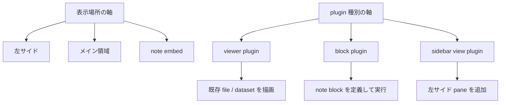
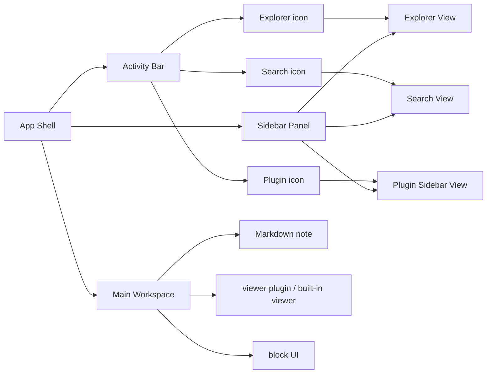

# 2026-04-16 18:34

## テーマ

VS Code の Activity Bar のような「エクスプローラーのさらに左にある縦メニューバー」を、IntegralNotes でも持ちたい。  
加えて、それを plugin から追加できる形にしたい、という相談を整理した。

## まず結論

今回の話は、次の 2 軸を分けると理解しやすい。

1. **どこに表示するか**
   - 左のサイド領域
   - メイン領域
   - note 内 embed
2. **何の plugin か**
   - file / dataset を表示する `viewer plugin`
   - note 内 block を定義・実行する `block plugin`
   - 左サイドの pane を増やす `sidebar view plugin`

ここを混ぜると、

- `sidepanel = viewer plugin?`
- `main = block plugin?`

のように見えてしまうが、実際にはそうではない。

## 整理

### 1. `viewer plugin`

`viewer plugin` は、**既存の file / dataset をどう描画するか**を担当する。

例:

- `.csv` を table viewer で開く
- `.idts` を専用 viewer で開く
- dataset 内の特定拡張子を専用 UI で見せる

つまり `viewer plugin` は **表示対象の型**に紐づく。  
どこで表示されるかは別問題で、メインタブでも embed でも使いうる。

### 2. `block plugin`

`block plugin` は、**note 内 block の意味と実行**を担当する。

例:

- Python callable を実行する `general-analysis`
- 装置制御 block
- dataset から renderable を作る処理 block

これは **ノート上の block schema / 実行責務**に紐づく。  
「メイン領域に出るから block plugin」という分類ではない。

### 3. `sidebar view plugin`

今回ほしいのはこれに近い。  
左の Activity Bar から切り替える pane を plugin が追加できるようにする。

例:

- Explorer
- Search
- Datasets
- Instruments
- Plugin 独自の navigator

これは `viewer plugin` とも `block plugin` とも別の責務で、  
**左サイド UI を拡張するための plugin contribution** として定義するのが自然。

## 図1: 軸を分けて考える

ポイントは、**表示場所と plugin 種別は直交する**ということ。

## 図2: ほしい構造

ここでの重要点は次の通り。

- `Activity Bar` 自体は app core が持つ
- plugin は `Activity Bar` そのものを差し替えるのではなく、**item と対応 view を登録する**
- `Sidebar Panel` に何を出すかを registry で切り替える

## 設計上の考え方

### Activity Bar 自体は core に置く

VS Code 的な縦バーそのものまで plugin にすると、土台が不安定になる。  
そのため、**shell は core 実装**にしておいた方がよい。

plugin に開放するのは次の contribution がよい。

- `sidebarViews`
  - `id`
  - `title`
  - `icon`
  - `placement`
  - `renderer`

## なぜ既存 plugin system に統合するのか

これは別系統に分けるより、既存 plugin system に contribution を 1 種追加する方がよい。

理由:

- plugin の発見・install・lifecycle を 1 箇所に寄せられる
- `viewer`, `block`, `sidebarView` を同じ manifest で持てる
- VS Code も「plugin system は一つ、その中に contribution point が複数」という考え方に近い

ただし、**責務まで一体化しない**のが大事。

- system は統合
- contribution type は分離

このバランスがよい。

## 現在の実装との関係

現状は `src/renderer/App.tsx` に explorer 用 sidebar がかなり直接的に入っている。  
なので、将来的に plugin 追加可能な Activity Bar を作るなら、次の分離が必要になる。

1. 左の縦バーを `ActivityBar` component として分離する
2. 右隣の sidebar 本体を `SidebarHost` として分離する
3. explorer を「built-in sidebar view」として registry 登録する
4. plugin も同じ registry に `sidebarViews` を登録できるようにする

## 最小方針

最初の実装方針としては、これが無理が少ない。

1. **Activity Bar shell は built-in**
2. **Explorer は built-in sidebar view として移植**
3. **plugin は `sidebarViews` だけ追加可能**
4. renderer は最初は `iframe` ベースでもよい

これなら、

- 先に UI 骨格を作れる
- plugin 拡張余地も確保できる
- `viewer plugin` や `block plugin` と責務を混同しない

## 一言で言うと

`sidepanel = viewer plugin` でも `main = block plugin` でもない。  
正しくは、

- `viewer plugin` は「何をどう表示するか」
- `block plugin` は「note block をどう定義し実行するか」
- `sidebar view plugin` は「左サイドにどんな pane を追加するか」

という別分類で考えるのがよい。

## 次にやるなら

実装に入る前に、まずは `sidebarViews` contribution の shape を 1 枚の設計文書に落とすのがよい。  
その後で `App.tsx` の explorer 固定構造を `ActivityBar + SidebarHost + ExplorerSidebarView` に分離すると、移行しやすい。
