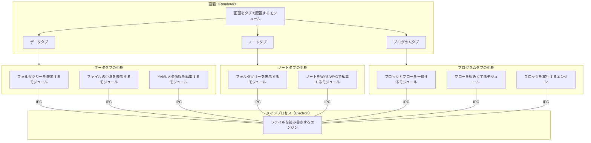
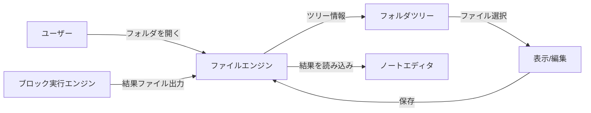

# IntegralNotes モジュール構成

## 全体構成

## モジュール一覧と役割

| # | モジュール名 | 役割 |
|---|---|---|
| 1 | ファイルを読み書きするエンジン | ファイルの読み書き・監視・検索をまとめて担う（メインプロセス側） |
| 2 | 画面をタブで配置するモジュール | データ/ノート/プログラムの3タブをflex-layoutで自由に配置する |
| 3 | フォルダツリーを表示するモジュール | フォルダ構造をツリー表示する（データタブとノートタブで共通利用） |
| 4 | ファイルの中身を表示するモジュール | 選択したデータファイルのプレビュー・サムネイル表示 |
| 5 | YAMLメタ情報を編集するモジュール | データファイルのYAML frontmatterを読み書きするUI |
| 6 | ノートをWYSIWYGで編集するモジュール | Markdownノートのリッチテキスト編集。グラフ等の埋め込み表示も担う |
| 7 | ブロックとフローを一覧するモジュール | 作成済ブロック・作成済フロー・実行スペースのサイドバー |
| 8 | フローを組み立てるモジュール | ブロックをD&Dで繋いでフローを作るキャンバス |
| 9 | ブロックを実行するエンジン | フロー内の各ブロック（=フォルダ内のスクリプト）を順に実行する |

## データの流れ

## 補足：仮実装での割り切り

- **フォルダツリーモジュール**はデータタブとノートタブで同じコンポーネントを使い回す
- **ブロック実行エンジン**は仮実装ではPythonスクリプトの実行のみ対応（将来Integral連携）
- **LLM連携**はモジュールとしては切り出さず、ノートエディタ内の機能として後で追加する
