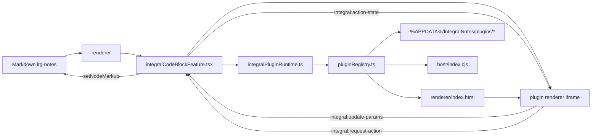
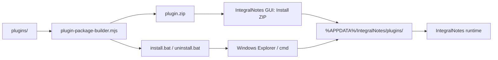

# pluginシステム

## 目的

- `itg-notes` block の描画と action 実行を IntegralNotes 本体から分離する。
- plugin はすべて `external plugin` として扱い、runtime の見方を 1 つに揃える。
- ユーザーには Node.js を要求せず、zip / GUI / 将来の store で install できるようにする。

## 現在の結論

- app runtime は `app.getPath("userData")/plugins/*` だけを読む。
- repo 内の `plugins/*` は runtime の install 先ではなく、plugin source と sample 実装の置き場。
- plugin の配布物は zip を基本にする。
- 開発中は zip + `install.bat` / `uninstall.bat` で配布できる。
- plugin store は後段とし、先に `interactive renderer` と block JSON 同期を確立する。

## plugin の配置先

```text
%APPDATA%\IntegralNotes\
  plugins\
    shimadzu.lc\
      integral-plugin.json
      renderer\
        index.html
      host\
        index.cjs
```

- app 本体はこの `plugins/*` だけを走査する。
- workspace 配下のファイルは plugin として自動実行しない。
- ノート共有と実行コード配布を切り離すため、plugin は workspace に置かない。

## repo 内の役割分担

```text
plugin-sdk/
  docs/
  schemas/
  src/

plugins/
  shimadzu-lc/
  standard-graphs/
  dist/
```

- `plugin-sdk/`
  - plugin 開発者向け contract, helper, schema
- `plugins/<plugin-name>/`
  - sample plugin の source
- `plugins/dist/`
  - zip / bat の配布物出力先

## 現在の runtime contract

### 最小構成

```text
my-plugin/
  integral-plugin.json
  renderer/
    index.html
  host/
    index.cjs
```

### manifest

- filename は `integral-plugin.json`
- schema は `plugin-sdk/schemas/integral-plugin.schema.json`
- `namespace` を 1 つ持つ
- `blocks[*].type` は必ず `<namespace>.` で始める
- 現在の contribution
  - `renderer`
  - `host`

manifest 例:

```json
{
  "apiVersion": "1",
  "id": "shimadzu.lc",
  "namespace": "LC",
  "displayName": "Shimadzu LC",
  "version": "0.1.0",
  "description": "LC method 系 block を提供する plugin",
  "renderer": {
    "entry": "renderer/index.html",
    "mode": "iframe"
  },
  "host": {
    "entry": "host/index.cjs",
    "runtime": "module"
  },
  "blocks": [
    {
      "type": "LC.Method.Gradient",
      "title": "LC Gradient",
      "description": "勾配プログラムを可視化し、実行 action を提供する。",
      "actions": [
        {
          "id": "execute",
          "label": "装置操作を実行",
          "busyLabel": "装置操作を送信中..."
        }
      ]
    }
  ]
}
```

### renderer

- `iframe` mode のみ
- main process が `renderer/index.html` を読み、renderer process が `iframe srcDoc` に渡す
- `renderer/index.html` 内の相対 asset path は app 側で plugin install directory から解決し、可能なものは data URL として `srcDoc` に埋め込む
- app -> plugin は `postMessage` で block 情報を渡す
- message type
  - app -> plugin
    - `integral:set-block`
    - `integral:action-state`
  - plugin -> app
    - `integral:update-params`
    - `integral:request-action`

### interactive renderer に向けた方針

- renderer を read-only preview に固定しない。block 固有の設定 UI は plugin renderer 側へ寄せる。
- plugin renderer が block 全体の UI を持つ。IntegralNotes 本体は plugin block の外側 toolbar / action button を常設しない。
- Markdown 上の `itg-notes` JSON を唯一の正とする。plugin renderer 内の state は一時 state であり、保存責務は app 本体の node view が持つ。
- 現在の MVP として `iframe postMessage` の reverse bridge を実装し、plugin renderer から app 本体へ `params` 更新を返せるようにした。
- 現在の MVP では plugin renderer が更新できるのは基本的に `params` のみとし、`type` や plugin manifest 由来の情報は app 側が保持する。
- app は更新を受けたら node の `value` を JSON 文字列として再 serialize し、保存対象 Markdown を更新する。
- app は正規化後の block を再度 `integral:set-block` で iframe に返し、plugin renderer と Markdown の内容を同期させる。
- privileged action の見た目は plugin renderer 側が持ってよいが、実行権限そのものは app / host 側に残す。

#### reverse bridge MVP

app -> plugin:

```json
{
  "type": "integral:set-block",
  "payload": {
    "block": {
      "type": "LC.Method.Gradient",
      "params": {}
    }
  }
}
```

plugin -> app:

```json
{
  "type": "integral:update-params",
  "payload": {
    "params": {
      "analysis-time": 8
    }
  }
}
```

- action request:

```json
{
  "type": "integral:request-action",
  "payload": {
    "actionId": "execute"
  }
}
```

- action state:

```json
{
  "type": "integral:action-state",
  "payload": {
    "actionId": "execute",
    "status": "running",
    "summary": "装置操作を送信中..."
  }
}
```

- full block 差し替えではなく `params` 更新に絞る方針は維持する。
- block JSON の整形、validation、unknown field の保持は app 本体側で行う。
- plugin renderer は外部プログラムや main process を直接叩かず、`integral:request-action` を通じて app 側へ委譲する。
- 将来的に必要なら `integral:resize` などを追加する。

### host

- `module` runtime のみ
- main process が `host/index.cjs` を CommonJS module として読む
- export 名は `runIntegralPluginAction`

## 現在の実行モデル



## install 導線

### いま使える導線

1. GUI から `Install ZIP`
2. zip と一緒に配る `install.bat`
3. 開発用 CLI (`plugin-installer.mjs`)

### 現在のフロー



### GUI install

- app header の `Plugins` から plugin manager を開く
- `Install ZIP` で zip を選ぶ
- main process が zip を展開し、manifest を検証して `userData/plugins/<pluginId>` に配置する
- `Uninstall` で install 済み plugin を削除できる

### zip + bat 配布

- `plugins/dist/<pluginId>/`
  - `<pluginId>-<version>.zip`
  - `install-<pluginId>.bat`
  - `uninstall-<pluginId>.bat`
- エンドユーザーは Node.js 不要
- `install.bat` は `%APPDATA%/IntegralNotes/plugins/<pluginId>` に展開する

## 開発者向けコマンド

- 配布物生成
  - `npm run plugins:package:all`
- sample plugin 個別
  - `npm --prefix plugins/shimadzu-lc run package:release`
  - `npm --prefix plugins/standard-graphs run package:release`
- 開発用 local install
  - `npm run plugins:install:all`
  - `npm --prefix plugins/shimadzu-lc run install:local`

## 実装ファイル

- contract / validator
  - `src/shared/plugins.ts`
- main 側 plugin runtime
  - `src/main/pluginRegistry.ts`
  - `src/main/main.ts`
  - `src/main/preload.ts`
- renderer 側 plugin runtime / manager
  - `src/renderer/integralPluginRuntime.ts`
  - `src/renderer/integralBlockRegistry.tsx`
  - `src/renderer/integralCodeBlockFeature.tsx`
  - `src/renderer/PluginManagerDialog.tsx`
  - `src/renderer/App.tsx`
- SDK
  - `plugin-sdk/src/*`
  - `plugin-sdk/schemas/integral-plugin.schema.json`
- sample plugin source
  - `plugins/shimadzu-lc/*`
  - `plugins/standard-graphs/*`

## 現在の制約

- plugin renderer が返せる更新は現在 `params` 全体の差し替えのみ
- raw JSON textarea は通常 UI から外し、編集導線は plugin renderer 側へ寄せた
- plugin renderer は UI 内ボタンから privileged action を要求できるが、実行権限自体は app / host 側が保持する
- validation / serialize は本体 renderer に残っている
- `type` や top-level field の編集権限は app 側に残している
- host は `stdio executable` ではなく module load の MVP
- GUI install は zip import のみで、store / server 連携はまだない
- zip install / package builder は現在 Windows 前提

## 次の段階

1. `LC.Method.Gradient` 以外の block でも plugin renderer の専用 GUI 編集を広げる
2. `integral:update-params` の先で validation / normalization / error UI を強化する
3. `integral:request-action` の権限確認や監査 UI を追加する
4. plugin ごとの schema / snippet / menu contribution を追加する
5. host runtime を `stdio executable` に拡張する
6. plugin store 用 catalog / download API を設計し、既存 install engine に接続する
